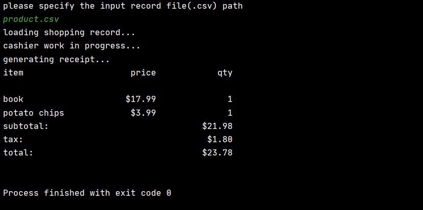

# Pinnacle Code Test

This program use .csv file as input. 
product name, price, quantity and location of the purchase are specified in the csv 
file with the following format:

```
name,price,quantity,location
book,17.99,1,CA
potato chips,3.99,1,CA
```

To config the tax rate and product categories, please edit the conf.json

## Run Code

To run the program, go to GenerateReceipt.java and run, the program
will ask for the input fileName, just type and press enter. Then 
the program will continue to run and finish the job, finally print
the receipt in the console. The following is a sample output.



## Unit Testing and Report
To run the unit testing and generate test report, please run the following
command in the home directory of this project
```
mvn clean test site jacoco:report
```
Then you find the
1) junit test report under target/site/index.html
2) test coverage report under target/site/jacoco/index.html
<br /><br />
** Those report are already in this repositories for your review ;-)

